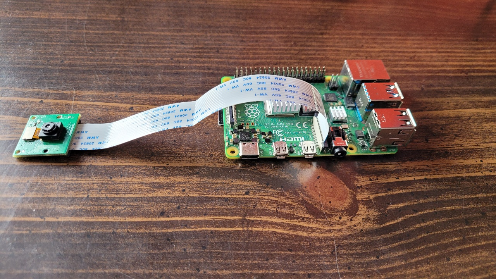
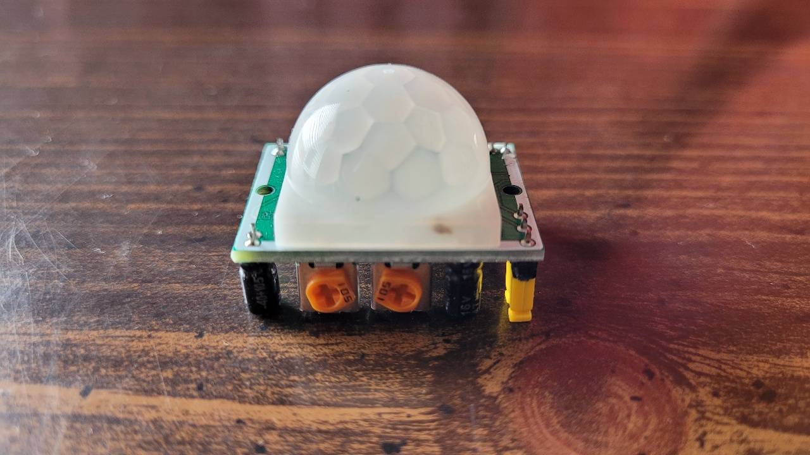
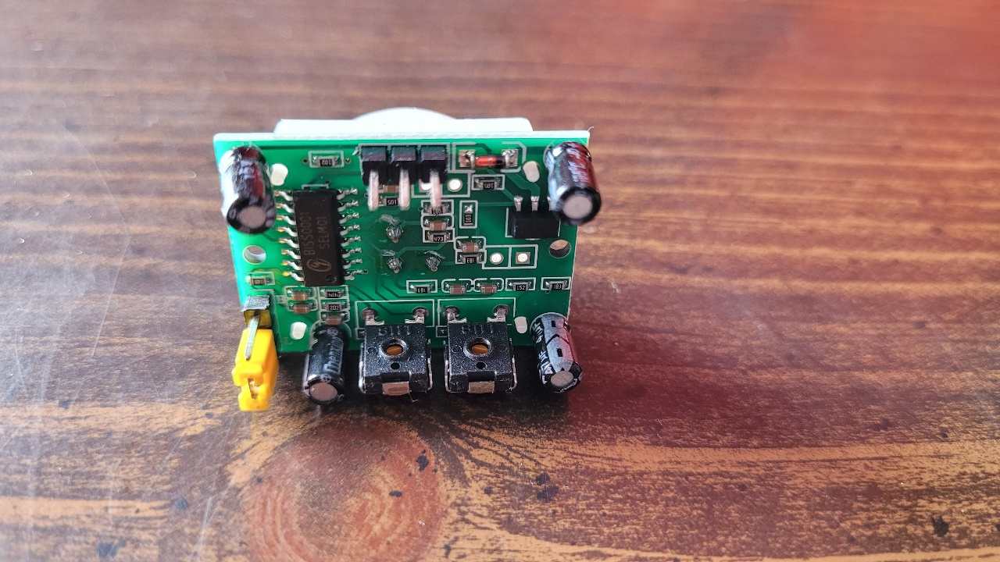
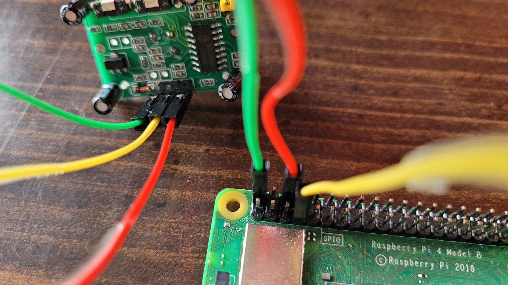
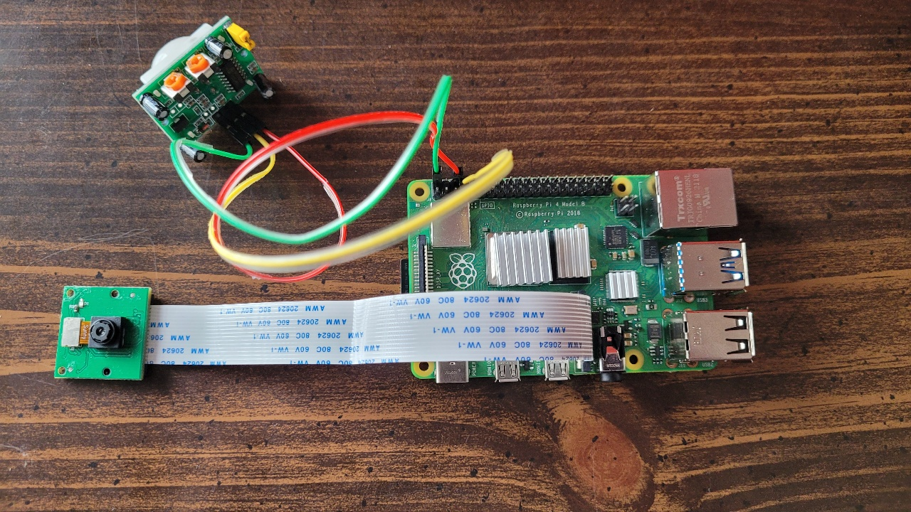

# Security Camera

A security camera built using a Raspberry Pi which records a video when motion is detected, uploads the recorded video to Google Drive, and uses Twilio to send a text message to the user informing them that motion was detected in the camera's area.

## Hardware
* Raspberry Pi 4 Model B
* Arducam 5MP OV5647 Camera Module
* HC-SR501 PIR Sensor
* 3 female-to-female jumper wires

First, start by connecting the Arducam Camera Module to the Raspberry Pi. Open the camera port by pulling up on its edges, insert the Module's cable into the port, and push the port back into place. Shown in the picture below is the result of these steps.

<br>
<p align="center"></p>
<br>

Next, connect the PIR sensor to the Raspberry Pi. But first, make the following adjustments to the PIR sensor's potentiometers. 

<br>
<p align="center"></p>
<br>

The left potentiometer is for time delay and the right potentiometer is for detection sensitivity. It's best to start with time delay set fully anti-clockwise and detection sensitivity set fully clockwise as shown in the picture above. You can make further adjustments once you start using the PIR sensor with your Raspberry Pi and see which settings work best for you.

<br>
<p align="center"></p>
<br>

The PIR sensor's pins are located opposite the potentiometers. In the picture above, the pins are at the top of the board in the following order from left to right: GND, Output, VCC.

Connect the PIR sensor's VCC pin to a 5V pin on the Raspberry Pi.
Connect the PIR sensor's GND pin to a ground pin on the Raspberry Pi. Connect the PIR sensor's Output pin to a GPIO pin on the Raspberry Pi. One of the few ways to fulfill these requirements is to connect VCC to pin 2, GND to pin 6, and Output to pin 7 using three female-to-female jumper wires. The result of this setup is shown in the picture below.

<br>
<p align="center"></p>
<br>

The final setup including the Arducam Camera Module and the PIR sensor is shown in the picture below.

<br>
<p align="center"></p>
<br>

Turn on your Raspberry Pi and go to the main menu by clicking on the Raspberry Pi icon in the top left corner of the screen. Go to Preferences > Raspberry Pi Configuration > Interfaces. Make sure that "Camera" is Enabled.

## Google Drive

Follow these instructions to [create a Google Cloud project](https://developers.google.com/workspace/guides/create-project).

Follow these instructions to [enable the Google Drive API](https://developers.google.com/workspace/guides/enable-apis).

Follow these instructions to [create access credentials](https://developers.google.com/workspace/guides/create-credentials). Go to the section with the "OAuth client ID credentials" heading and follow the instructions in the "Web application" tab. You can skip step 6 which explains how to add authorized URIs to your app since that's not necessary for this project.

Download the created credentials from the "OAuth 2.0 Client IDs" section. The JSON file should be saved as ```client_secret``` followed by a bunch of random characters. Rename this file to ```credentials.json``` and place it in your project folder.

Next, follow these instructions to [generate a token](https://developers.google.com/drive/api/quickstart/python). You can use the code from the ```quickstart.py``` file in this repository since it includes a small but important change to the ```quickstart.py``` code in the link above. The change modified line 12 from 
```
SCOPES = ['https://www.googleapis.com/auth/drive.metadata.readonly']
```
to

```
SCOPES = ['https://www.googleapis.com/auth/drive']
```
This is to ensure that the token that's created provides enough permissions to let the user upload files to Google Drive.

Run ```quickstart.py``` from the project folder to generate a ```token.json``` file.

## Twilio

Sign up for a free [Twilio](https://www.twilio.com/) account. After verifying your email address and phone number, there is a page which will ask you to "choose what you prefer". Select "I just need my Account SID and Auth Token". You will arrive at the Twilio Console. Click "Get a trial phone number" to get your own Twilio phone number. 

Follow these instructions to [install the Twilio library and test your installation](https://www.twilio.com/docs/libraries/python) using your Account SID, Auth Token, and Twilio phone number.

## Run on Startup
Open the Raspberry Pi terminal.  Run the ```crontab -e``` command if you're logged in as a non-root user. Run the ```sudo crontab -e``` command if you're logged in as root. Scroll all the way to the bottom of the file below all the comments and add the following line:
```
@reboot sleep 60 && python3 /path/to/folder/security.py
```

This lets you the run the ```security.py``` script as soon as the Raspberry Pi starts, meaning you don't need to manually run the script by connecting your Raspberry Pi to a monitor, keyboard, & mouse or by SSH'ing into your Raspberry Pi. 

You can take your Raspberry Pi (and Arducam Camera Module and PIR sensor) to a location you want to monitor, plug in the Raspberry Pi, and let the Security Camera do its work.